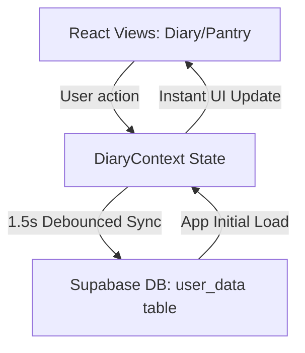

# Muncher Macros v2 — Codebase Architecture & Skeleton

This document serves as the structural guide and developer map for the **Muncher Macros v2** workspace. It outlines the codebase layout, components, and data synchronization patterns.

---

## 📁 Directory Skeleton

```text
Muncher_Macros_v2/
├── 📁 api/                      # ⚡ Vercel Serverless Backend Gateways
│   ├── ai-barcode.js            # Claude-powered barcode digit OCR fallback
│   ├── ai-describe.js           # Analyze Meal Intelligence complex text parser
│   ├── ai-ingredients.js        # Splits composite recipes into individual items
│   ├── ai-label.js              # Claude-powered Nutrition Facts OCR analyzer
│   ├── ai-lookup.js             # Conversational single-item search handler
│   ├── off-search.js            # Open Food Facts barcode client lookup
│   ├── carbClassifier.js        # Science-based ingredient sorting
│   └── check.js                 # API keys & model diagnostic tool
│
├── 📁 src/                      # 🎨 Client React Application
│   ├── main.tsx                 # App mount & global DOM wrapper
│   ├── App.tsx                  # Core router and page routing setup
│   ├── index.css                # Custom global stylesheet (110k+ lines, HSL design system tokens, themes)
│   │
│   ├── 📁 pages/                # 🖥️ Top-Level Screens
│   │   ├── LoginScreen.tsx      # Email + Google OAuth Supabase Auth screen
│   │   └── MainDashboard.tsx    # Responsive Shell, bottom navigation, and layout switcher
│   │
│   ├── 📁 context/              # 🔄 Global React State Managers
│   │   ├── AuthContext.tsx      # Supabase Session, User states, Guest modes
│   │   ├── DiaryContext.tsx     # Local-first cache manager, cloud debounced sync, custom foods DB state
│   │   └── ThemeContext.tsx     # Applies active theme CSS variables dynamically
│   │
│   ├── 📁 components/           # 🧩 Modular Interactive Elements
│   │   ├── DiaryView.tsx        # Personal Diary logs, serving adjustments, 7-day average nutrient details
│   │   ├── PantryView.tsx       # "The Vault" Custom foods list, filters, and complex recipe generators
│   │   ├── ProgressView.tsx     # Streaks, prestige milestones, water tracker, caloric analytics
│   │   ├── SettingsView.tsx     # Metric/Imperial toggles, email updates, account deletion options
│   │   ├── AddFoodModal.tsx     # Global slide-up drawer for searches, scanner mounts, AI staged meals
│   │   ├── BarcodeScanner.tsx   # Camera uploads, dynamic crop aspects, Clipboard pasting
│   │   ├── ImageCropperModal.tsx# Handles touch layouts & aspect frames (wide barcode vs. square label)
│   │   ├── WeightHistoryChart.tsx# Recharts/ChartJS weight charting panel
│   │   └── BackgroundGlow.tsx   # Ambient floating glowing animation container
│   │
│   ├── 📁 lib/                  # 🛠️ Helper Utilities & Core Science Algorithms
│   │   ├── supabase.ts          # Configures client-side Supabase keys & URLs
│   │   ├── constants.ts         # Centralizes nutritional indexes, units, and custom shop themes
│   │   ├── nutrient-info.ts     # Science-based micronutrient goals, categories, and educational text
│   │   ├── badge-info.ts        # Milestones and profile titles
│   │   └── 📁 vision/           # Client scanning algorithm handlers (ZXing)
│   │
│   └── 📁 types/                # 🏷️ TypeScript Blueprint Interfaces
│       └── food.ts              # Custom TS schemas for Food items, Staged entries, Logs, Macros
│
├── package.json                 # Core dependencies (React 19, Supabase, Lucide, Recharts)
├── tsconfig.json                # Project-wide TypeScript configurations
├── vite.config.ts               # Bundler rules, asset handling, and build routes
└── vercel.json                  # Dynamic routes rewriting rules for serverless `/api` endpoints
```

---

## 🔄 Core Data Architecture

Muncher Macros v2 is designed around a high-performance **Local-First, Cloud-Synced** state engine:



1. **Local-First Speed:** Any logs, edits, theme changes, or custom foods entered by the user are immediately written to local React context state (`localCache`). The user interface updates in **0 milliseconds** with no network spinners.
2. **Debounced Syncing:** Once the user stops interacting with the UI for **1.5 seconds**, the `DiaryContext` automatically executes a debounced sync operation, pushing the updated JSON model to the Supabase PostgreSQL database `user_data` table.
3. **Robust Backend Offline Support:** If the network goes offline, state saves safely in local storage fallback, updating the user's sync status to `offline` until reconnection is established.

---

## 🛡️ Future Backend Scaling Goals

When migrating from early launch stage to large-scale production, the following enhancements should be implemented:

1. **Supabase Row-Level Security (RLS):** Apply active database policies to restrict query access strictly to authenticated session owners (`auth.uid() = user_id`).
2. **API Gateways & Rate-Limiting:** Incorporate edge rate-limiters (e.g. Upstash Redis) on Vercel AI routes (`/api/ai-describe`, `/api/ai-label`, `/api/ai-barcode`) to protect token keys and limit spamming.
3. **Database Normalization:** Migrate long-term historical logs out of the single massive `user_data` JSON blob and split into individual partitioned tables (`profiles`, `food_logs`, `custom_foods`) to guarantee microsecond query times as data matures.
